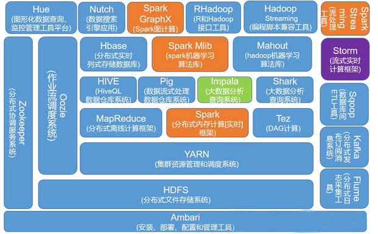

**bigdata_on_docker**

Run Hadoop and Machine Learning platforms in Docker containers

## Get Docker Images
1. [Using Images from docker.io](images_aliyun.md)
1. [Using Images from aliyun](images_aliyun.md) (Faster in China)

## Run Hadoop in Docker containers

1. [Hadoop on Docker](hadoop)
1. [Spark on Docker](spark)

**Hadoop plateform ecosystem panorama**

## Run Machine Learning in Docker containers
1. jupyter

---
@HSDOCKER Elastic Big Data Platform project   
Related projects:  [Big data technology running on Kubernetes](https://github.com/hbulpf/HSDocker)  